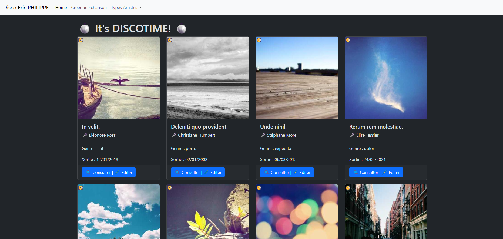
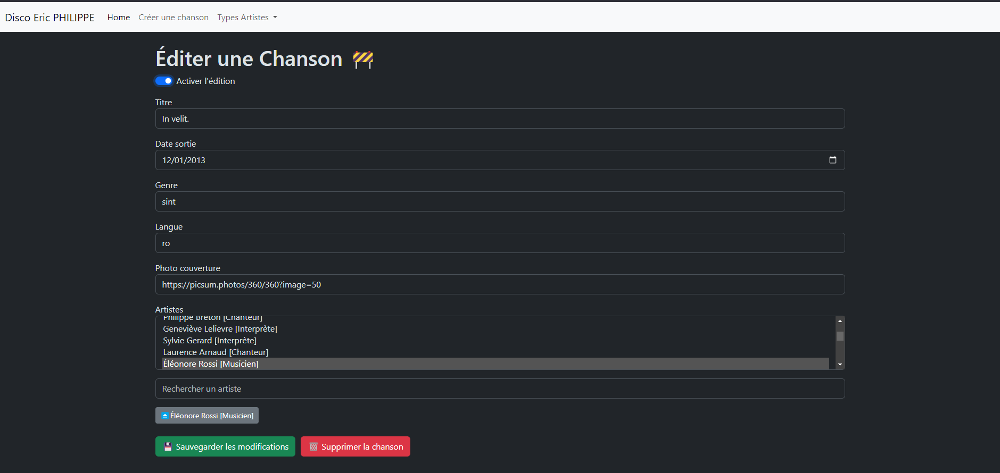
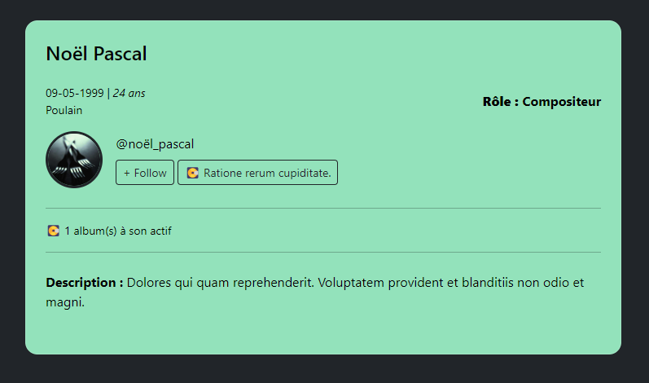

# Basic Music Manager App

Welcome to the Basic Music Manager App project! 

This project was developed as part of a computer science course to apply fundamental PHP web development concepts.

## Description

Basic Music Manager App is a lightweight web application for managing songs. It provides CRUD (Create, Read, Update, Delete) functionality for songs, along with the ability to browse artists and filter songs by artist type.

## Technologies

| Name | Version |
| ---- | ------- |
| PHP  |   7.4.9 |
| Symfony | 5.1.7 |
| Composer | 1.10.13 |
| Bootstrap | 4.5.3 |
| mySQL | 8.0.22 |

## Features

- CRUD operations for songs (Create, Read, Update, Delete)
- Artist browsing
- Song filtering by artist type

## Illustrations

## Usage

1. Install PHP Symfony: [link](https://symfony.com/download)
2. Clone the repository: `git clone https://github.com/Eric-Philippe/Basic-Music-Manager-App.git`
3. Navigate to the directory: `cd basic-music-manager-app`
4. Install dependencies: `composer install`
5. Start the server: `symfony server:start`
6. Navigate to the URL provided by the server
